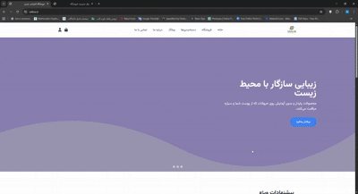

# 🛍 Odour

**Fullstack eCommerce app for Sheglam products**  
Built with **Node.js, Express, and MongoDB**, Odour is an online shop featuring authentication, cart system, order tracking, SEOfriendly product management, and a powerful custom admin panel.


## 🚀 Features
 🔐 **Authentication & Authorization** (JWTbased login/signup)
 🛒 **Shopping Cart** (add/remove items, apply offer codes)
 📦 **Order Tracking** (track order status from profile)
 💳 **Payment Integration** (checkout process with discount support)
 🎨 **Product Variants** (choose size & color before purchase)
 🔎 **Instant Filtering** (filter products without reloading)
 🧑‍💻 **Custom Admin Panel**:
   Add/edit products with **WordPresslike editor** (rich text, SEO fields, image uploads)
   Manage categories & brands
   View, update, and track all orders
   Rolebased admin management (future)


## 🛠 Tech Stack
 **Backend:** Node.js, Express, MongoDB  
 **Frontend:** HTML, CSS, Bootstrap, Tailwind CSS, JavaScript (by teammate)  


## 📸 Demo
👉 odour.ir




## ⚙️ Installation
```bash
# clone the repo
git clone https://github.com/nima256/Odour

# install dependencies
npm install

# run server
npm start

